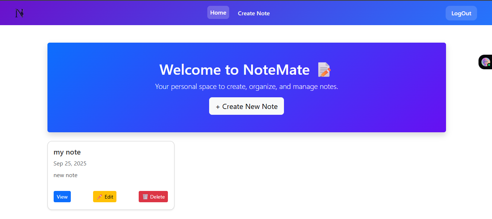
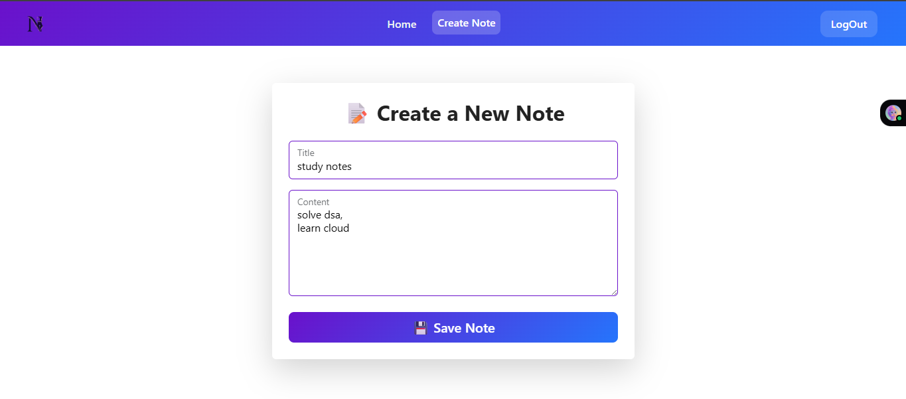
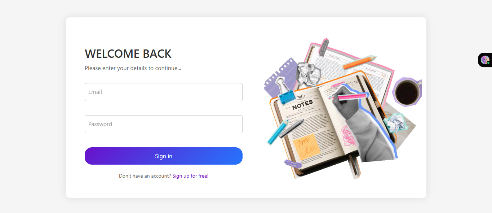
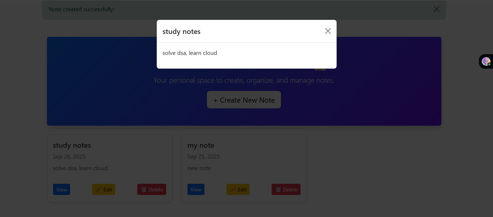

# 📝 NoteMate

**NoteMate** is a simple yet powerful note-taking web application built with **Django**.  
It allows users to securely create, edit, and manage notes with an intuitive interface and a clean design.

---

## 📌 Overview
- User authentication (signup, login, logout).  
- Create, edit, and delete notes.  
- Secure data handling with Django’s authentication system.  
- Responsive, minimal, and user-friendly UI (Bootstrap integrated).  
- Backend powered by Django ORM with PostgreSQL support.

---

## ⚙️ Installation & Setup

To set up the project locally, follow these steps:

```bash
# 1. Clone the repository
git clone https://github.com/your-username/notemate.git
cd notemate

# 2. Create a virtual environment and activate it
python -m venv venv
# Windows:
venv\Scripts\activate
# Linux/Mac:
source venv/bin/activate

# 3. Install dependencies
pip install -r requirements.txt

# 4. Configure environment variables
# Create a .env file in the root directory and add:
# SECRET_KEY=your_secret_key
# DEBUG=True
# DATABASE_URL=your_database_url

# 5. Apply database migrations
python manage.py migrate

# 6. Start the development server
python manage.py runserver


```


## 📂 Inputs & Outputs
**Inputs**

- User-provided credentials (username, email, password).

- Note content (title, text).

**Outputs**

- Dynamic note dashboard with CRUD functionality.

- Secure storage of user-specific notes.

- Auth-based access (only logged-in users can manage notes).

---

## 🔬 Workflow Explained

**Authentication** → Django’s built-in system for signup, login, logout.

**Database Setup** → Notes and users stored securely in PostgreSQL (or SQLite for local dev).

**Note Operations** → Create, read, update, delete notes seamlessly.

**Frontend** → Clean UI with Bootstrap for responsiveness.

**Routing** → Django views handle navigation (login → dashboard → note editor).

---

## 📊 Example Screens

### Dashboard View


### Note Editor


### Login Page


### View Note


---

## 👨‍💻 Author

Shashwat Singh
📧 Email: shashwat.singh2027@gmail.com

💼 LinkedIn: (https://www.linkedin.com/in/singhshashwat26/)

🐙 GitHub: https://github.com/shashwat2645